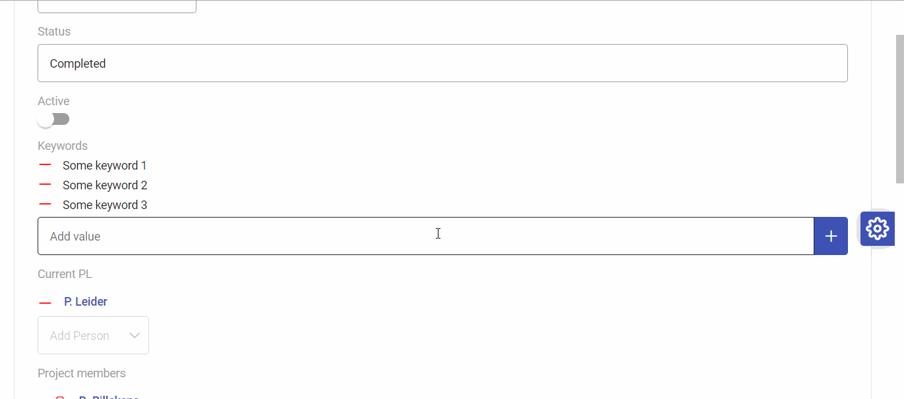
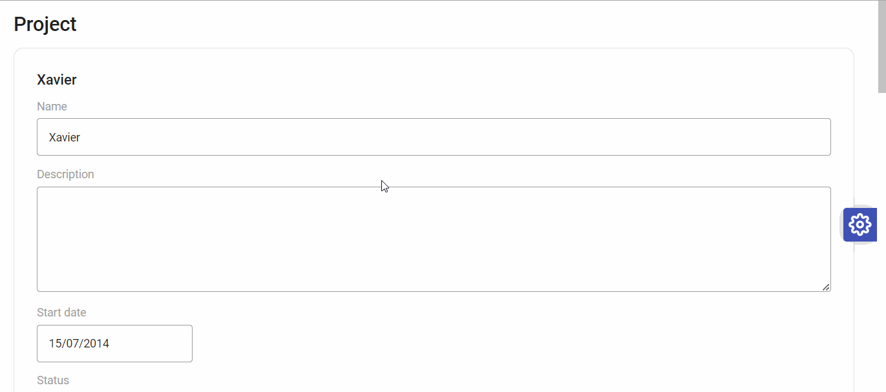

# Atomic Components

Within Ampersand, Atomic-Components represent a real-world thing in an information system context, e.g. `"Caroline"`, `5`, `1917-11-07`.

### BaseAtomicComponent

The `BaseAtomicComponent` is inherited by all of the Atomic-Components. It serves as a shell that contains the basic data that the Atomic-Components need. This is done so that the atomic-components do not require a lot of duplicate code, since Atomic-Components have a lot of shared logic.

- CRUD rights are shared
- isUni and isTot relations are shared
- `addItem()` and `removeItem()` is used for non-univalent Atomic-Components. 
- `isNewItemInputRequired()` is used to check if at least one item is required (isTot relation).
- `addMessage()` is used for sending notifications on errors/successes regarding updates on the Atomic-Component data. 

## Atomic-Components

The Atomic-Components represent a real-world thing that represents values of data. The CRUD rights decides what kind of Atomic-Component is shown. The Atomic-Components can only be read or updated.

There are in general 4 cases:

- It can only read and not updated. This is not dependent on the univalent relation.
- It can be updated (and thus also read) while it is univalent. Univalent meaning there can be at most one, the update in this case is changing that specific value.
- It can be updated (and thus also read) while it is NOT univalent. This means that there can be multiple items and allows for the use of adding and removing items.
- It cannot be read.

The logic for the Atomic-Components are more or less the same with slight changes on how the data is viewed and differing in the `initFormControl()` function that initializes the data as a FormControl and has customized mappings for the `patch()` function.

## Atomic-Alphanumeric

The alphanumeric serves as a simple text input field.

Since an empty string is also a value, we have decided to map the empty string to `null` in the database.

## Atomic-Bigalphanumeric

The bigalphanumeric serves as a simple text input field that is larger than the alphanumeric.

Since an empty string is also a value, we have decided to map the empty string to `null` in the database.

## Atomic-Hugealphanumeric

The hugealphanumeric serves as a simple text input field that is even larger than the bigalphanumeric.

Since an empty string is also a value, we have decided to map the empty string to `null` in the database.

## Atomic-Password

The password serves as a simple password input field.

Since an empty string is also a value, we have decided to map the empty string to `null` in the database.

One error that we have not yet found a better solution to use is clicking on the show "show password" icon. This triggers a change in the `this.formControl.valueChanges` that we previously used for patching values. A quick solution that we came up with is simply having a seperate save button right next to the form that calls the `patch` function.

## Atomic-Date

The date serves as an input field that opens in the form of a calendar. It is saved in the ISO format `yyyy-MM-dd`, e.g. `"2023-03-14"`

A problem that occured is due to the timezone differences, the date would sometimes be off by one day depending on the time the update has occured. This has been resolved by using the `Date.getTimezoneOffset() * 600000`.

## Atomic-Datetime

The datetime serves as an input field that opens in the form of a calendar with time. It is saved in the ISO format `yyyy-MM-dd'T'HH:mm:ss`, e.g. `"2023-03-14T15:08:03+01:00"`.

A problem that occured is due to the timezone differences, the date would sometimes be off by one day depending on the time the update has occured. This has been resolved by using the `Date.getTimezoneOffset() * 60000`.

## Atomic-Integer

The integer serves as a simple input field that allows only integers, no text or decimals, e.g. `'12345'`

## Atomic-Float

The float serves as a simple input field that allows only floats, no text, e.g. `'12345'`, `'12345,6789'`. Every integer is a valid float.

## Atomic-Object

The Atomic-Object is a special Atomic-Component. It is the only Atomic-Component that is able to use the Delete rights. It serves as a connection between objects using the relations specified in the `.adl` file through Ampersand.

The Atomic-Object's value can be used to route to the page with respect to the object itself. For example routing to the route `object/:id`, or it's edit page.

It is also used for relations between multiple objects. See for example the project relation where `each project` can have `multiple project members`.

In addition to the `addItem()` and `removeItem()`, the Atomic-Object also has a `deleteItem()`. This not only has the functionality of `removeItem()`, but also deletes that object within the database.
