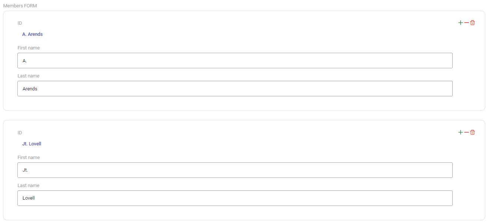
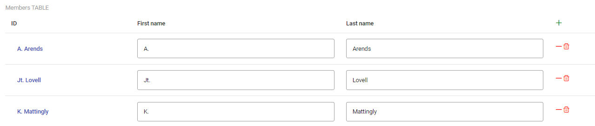

# Components

With the ampersand project, its possible to create a variety of input fields and ways to display those input fields or simply data.
Every component features a couple of default options in the form of attributes. These attributes are listed in het following table:

| attribute | value   | description                                                                                                                                                                                                                                                                                                                                                                                                                                                                               |
| --------- | ------- | ----------------------------------------------------------------------------------------------------------------------------------------------------------------------------------------------------------------------------------------------------------------------------------------------------------------------------------------------------------------------------------------------------------------------------------------------------------------------------------------- |
| label     | string  | The desired label text.                                                                                                                                                                                                                                                                                                                                                                                                                                                                   |
| isUni     | boolean | If this attribute is added to the element, the element's data is **univalent**. This means that for any `a` in `A` there can be not more than one `b` in `B` in the population of `r`. This implies that every a occurs not more than once (is unique) in the source of `r`. If it is not present, it's **injective**. This means that For any `b` in `B` there can be not more than one `a` in `A` in the population of `r`. So, every b occurs not more than once in the target of `r`. |
| isTot     | boolean | If this attribute is added to the element, the element's data is total. This means that for any `a` in `A` there must be at least one `b` in `B` in the population of `r`.                                                                                                                                                                                                                                                                                                                |
| crud      | string  | The CRUD-annotation specifies `Create`, `Read`, `Update`, and `Delete` rights for the term it follows. Capital = allowed, Non-capital = not allowed. CRUD is the default, so if you specify nothing, everything is allowed.                                                                                                                                                                                                                                                               |

# Atomic-Components

Atomic components (also known as atoms) provide a way to get user input or let the user change the input. The way to bind a concept to a atomic component in an ampersand script, works as follows:

```
REPRESENT <Concepts> TYPE <Atomic type>
```

There is an example provided for every atomic component listed below.

Within Ampersand, Atomic-Components represent a real-world thing in an information system context, e.g. `"Caroline"`, `5`, `1917-11-07`.

## BaseAtomicComponent

The `BaseAtomicComponent` is inherited by all of the Atomic-Components. It serves as a shell that contains the basic data that the Atomic-Components need. This is done so that the atomic-components do not require a lot of duplicate code, since Atomic-Components have a lot of shared logic.

- CRUD rights are shared
- isUni and isTot relations are shared
- `addItem()` and `removeItem()` is used for non-univalent Atomic-Components. 
- `isNewItemInputRequired()` is used to check if at least one item is required (isTot relation).

## Alphanumeric Component

The purpose of this component, and the associated code, is to allow users to enter text in the form of a string. The text field represents strings of short length, i.e. less than 255 characters. The alphanumeric component is in other words a text field.

### How does it work in an ampersand script:

To use the alphanumeric component in your script, add the following statement:

```
REPRESENT ProjectName, ProjectStatus TYPE ALPHANUMERIC
```

### How does it work in the front-end:

The front-end provides an atomic-alphanumeric component that accepts attributes that act on this component. The following is an example of the alphanumeric component on the front-end side:

```html
<app-atomic-alphanumeric [property]="data" label="Name" isUni isTot crud="cRUd"></app-atomic-alphanumeric>
```

The different attributes that the front-end component accepts are listed in the table below.

| attribute | value  | description                                                       |
| --------- | ------ | ----------------------------------------------------------------- |
| property  | string | Display's the current value that is pre-filled in the text field. |

Since an empty string is also a value, we have decided to map the empty string to `null` in the database.

## Bigalphanumeric Component

The purpose of this component, and the associated code, is to allow users to enter more text in the form of a string than the normal alphanumeric field. The component represents large strings of limited length, i.e. less than 64 kb. The bigalphanumeric component is in other words a textarea.

### How does it work in an ampersand script:

To use the bigalphanumeric component in your script, add the following statement:

```
REPRESENT Description TYPE BIGALPHANUMERIC
```

### How does it work in the front-end:

The front-end provides an atomic-bigalphanumeric component that accepts attributes that act on this component. The following is an example of the bigalphanumeric component on the front-end side:

```html
<app-atomic-bigalphanumeric [property]="data" label="Description" isUni isTot crud="cRUd"></app-atomic-bigalphanumeric>
```

The different attributes that the front-end component accepts are listed in the table below.

| attribute | value  | description                                                           |
| --------- | ------ | --------------------------------------------------------------------- |
| property  | string | Display's the current value that is pre-filled in the textarea field. |

Since an empty string is also a value, we have decided to map the empty string to `null` in the database.

## Hugealphanumeric Component

The purpose of this component, and the associated code, is to allow users to enter text in the form of a string of arbitrary length. It contains a complete editor for the text that is filled in by the user.

### How does it work in an ampersand script:

To use the hugealphanumeric component in your script, add the following statement:

```
REPRESENT Articletext TYPE HUGEALPHANUMERIC
```

### How does it work in the front-end:

The front-end provides an atomic-hugealphanumeric component that accepts attributes that act on this component. The following is an example of the hugealphanumeric component on the front-end side:

```html
<app-atomic-hugealphanumeric
  [property]="data"
  label="Description"
  isUni
  isTot
  crud="cRUd"
></app-atomic-hugealphanumeric>
```

The different attributes that the front-end component accepts are listed in the table below.

| attribute | value  | description                                                         |
| --------- | ------ | ------------------------------------------------------------------- |
| property  | string | Display's the current value that is pre-filled in the editor field. |

Since an empty string is also a value, we have decided to map the empty string to `null` in the database.

## Boolean Component

The boolean component takes a true/false value to determine if something is true or false in the form of a switch. When the user clicks the switch, it toggles it from false to true or vice versa.

### How does it work in an ampersand script:

To use the boolean component in your script, add the following statement:

```
REPRESENT ProjectActive TYPE BOOLEAN
```

### How does it work in the front-end:

The front-end provides an atomic-boolean component that accepts attributes that act on this component. The following is an example of the boolean component on the front-end side:

```html
<app-atomic-boolean [property]="true" isUni crud="cRUd"></app-atomic-boolean>
```

The different attributes that the front-end component accepts are listed in the table below.

| attribute | value   | description                                                 |
| --------- | ------- | ----------------------------------------------------------- |
| property  | boolean | The current state in the form of a boolean (true or false). |

## Date Component

The date component allows the user to fill in a date in the format that you desire. When you click on the date field, a calendar shows up to choose any date. The component represent dates compatible with ISO8601. The date serves as an input field that opens in the form of a calendar. It is saved in the ISO format `yyyy-MM-dd`, e.g. `"2023-03-14"`

### How does it work in an ampersand script:

To use the date component in your script, add the following statement:

```
REPRESENT ProjectStartDate TYPE DATE
```

### How does it work in the front-end:

The front-end provides an atomic-date component that accepts attributes that act on this component. The following is an example of the date component on the front-end side:

```html
<app-atomic-date [property]="'26-11-1999'" [format]="'dd-mm-yy'" isUni isTot crud="cRUd"></app-atomic-date>
```

The different attributes that the front-end component accepts are listed in the table below.

| attribute | value  | description                                                                                                                                                                                                                                 |
| --------- | ------ | ------------------------------------------------------------------------------------------------------------------------------------------------------------------------------------------------------------------------------------------- |
| property  | string | Display's the current value that is pre-filled in the date field.                                                                                                                                                                           |
| format    | string | The default format of a date in the component is yy-mm-dd. You are able to change this by setting this format field. Possible formats can be found when you scroll down at the following page: https://www.primefaces.org/primeng/calendar. |

A problem that occured is due to the timezone differences, the date would sometimes be off by one day depending on the time the update has occured. This has been resolved by using the `Date.getTimezoneOffset() * 600000`.

## DateTime Component

The datetime component builds upon the date component. It adds the ability to choose a time. The component represent dates compatible with ISO8601. The datetime serves as an input field that opens in the form of a calendar with time. It is saved in the ISO format `yyyy-MM-dd'T'HH:mm:ss`, e.g. `"2023-03-14T15:08:03+01:00"`.

### How does it work in an ampersand script:

To use the datetime component in your script, add the following statement:

```
REPRESENT ProjectStartTime TYPE DATETIME
```

### How does it work in the front-end:

The front-end provides an atomic-datetime component that accepts attributes that act on this component. The following is an example of the datetime component on the front-end side:

```html
<app-atomic-datetime [property]="'26-11-1999 23:46'" isUni isTot crud="cRUd"></app-atomic-datetime>
```

The different attributes that the front-end component accepts are listed in the table below.

| attribute | value  | description                                                           |
| --------- | ------ | --------------------------------------------------------------------- |
| property  | string | Display's the current value that is pre-filled in the datetime field. |

A problem that occured is due to the timezone differences, the date would sometimes be off by one day depending on the time the update has occured. This has been resolved by using the `Date.getTimezoneOffset() * 60000`.

## Float Component

The float serves as a simple input field that allows only floats, no text, e.g. `'12345'`, `'12345,6789'`. This makes it possible to add a comma into the input field. A float consist of floating-point numbers compatible with ISO8601. Every integer is a valid float.

### How does it work in an ampersand script:

To use the float component in your script, add the following statement:

```
REPRESENT Costs TYPE FLOAT
```

### How does it work in the front-end:

The front-end provides an atomic-float component that accepts attributes that act on this component. The following is an example of the float component on the front-end side:

```html
<app-atomic-float [property]="'99,99'" isUni isTot crud="cRUd"> </app-atomic-float>
```

The different attributes that the front-end component accepts are listed in the table below.

| attribute | value  | description                                                        |
| --------- | ------ | ------------------------------------------------------------------ |
| property  | string | Display's the current value that is pre-filled in the float field. |

## Integer Component

The integer serves as a simple input field that allows only integers, no text or decimals, e.g. `'12345'. It represents positive and negative whole numbers in the range [-2^63..2^63 -1]

### How does it work in an ampersand script:

To use the integer component in your script, add the following statement:

```
REPRESENT Amount TYPE INT
```

### How does it work in the front-end:

The front-end provides an atomic-integer component that accepts attributes that act on this component. The following is an example of the integer component on the front-end side:

```html
<app-atomic-integer [property]="'1234567890'" isUni isTot crud="cRUd"></app-atomic-integer>
```

The different attributes that the front-end component accepts are listed in the table below.

| attribute | value  | description                                                          |
| --------- | ------ | -------------------------------------------------------------------- |
| property  | string | Display's the current value that is pre-filled in the integer field. |

## Object Component

The object component allows the user to inspect and read more of an entity and adds a dropdown of different actions that the user can take on the entity.

The Atomic-Object is a special Atomic-Component. It is the only Atomic-Component that is able to use the Delete rights. It serves as a connection between objects using the relations specified in the `.adl` file through Ampersand.

The Atomic-Object's value can be used to route to the page with respect to the object itself. For example routing to the route `object/:id`, or it's edit page.

It is also used for relations between multiple objects. See for example the project relation where `each project` can have `multiple project members`.

In addition to the `addItem()` and `removeItem()`, the Atomic-Object also has a `deleteItem()`. This not only has the functionality of `removeItem()`, but also deletes that object within the database.

### How does it work in an ampersand script:

To use the integer component in your script, add the following statement:

```
REPRESENT Project TYPE OBJECT
```

### How does it work in the front-end:

The front-end provides an atomic-object component that accepts attributes that act on this component. The following is an example of the object component on the front-end side:

```html
<app-atomic-object [property]="activeProjects" isUni isTot crud="cRUd"> </app-atomic-object>
```

The different attributes that the front-end component accepts are listed in the table below.

| attribute | value        | description                                                                                            |
| --------- | ------------ | ------------------------------------------------------------------------------------------------------ |
| property  | Array\<any\> | Display's the name of the object and adds links to desired actions, like editing or viewing the entity |

## Password Component

The password component allows the user to type in their password, without showing it on the screen.

### How does it work in an ampersand script:

To use the password component in your script, add the following statement:

```
REPRESENT Password TYPE PASSWORD
```

### How does it work in the front-end:

The front-end provides an atomic-password component that accepts attributes that act on this component. The following is an example of the password component on the front-end side:

```html
<app-atomic-password [property]="'Pre-set value'" isUni isTot crud="cRUd"></app-atomic-password>
```

The different attributes that the front-end component accepts are listed in the table below.

| attribute | value  | description                                                                                        |
| --------- | ------ | -------------------------------------------------------------------------------------------------- |
| property  | string | Sets the current value that is pre-filled in the password field. You might never want to use this. |

Since an empty string is also a value, we have decided to map the empty string to `null` in the database.

One error that we have not yet found a better solution to use is clicking on the show "show password" icon. This triggers a change in the `this.formControl.valueChanges` that we previously used for patching values. A quick solution that we came up with is simply having a seperate save button right next to the form that calls the `patch` function.

# Box Components

Within Ampersand, Box-Components are a type of interface components that represent a structure. This structure is meant to contain other interface components.

For example, you might want to have a project page with a project name and members that are on that specific project. This could look like:

```
Project page
│   Project name
|   Description
|   Start date
└───Project members
    |   Member1
    |   └───Name
    |   └───Email
    |   Member2
    |   └───Name
    |   └───Email
    |   Member3
    |   └───Name
    |   └───Email
```

This corresponds to the following structure:

```
Box-Form
│   Atomic-Alphanumeric
│   Atomic-Bigalphanumeric
│   Atomic-Date
└───Box-Table
    │   Atomic-Alphanumeric
    |   Atomic-Alphanumeric
```

## BaseBoxComponent

The `BaseBoxComponent` is inherited by all of the Box-Components. Box-Components share a lot of logic, so the BaseBoxComponent is inherited by all Box-Components. Here is a list of functionality that all Box-Components require:

- CRUD rights
- `createItem()`
- `removeItem()`
- `deleteItem()`
- `@Input resource`
- `@Input propertyName`

### CRUD rights

Each Box-Component has CRUD rights. These rights give the user the ability to Create, Read, Update, and/or Delete items.

### Create Item

The `createItem()` function allows a new instance to be **created** for the Box-Component. Take for instance the Box-Table for the table of members that are working in a project. This allows creating a new person that works on the same project.

### Remove item

The `removeItem()` function allows items to be **removed** from the Box-Component. Take for instance the Box-Table for the table of members that are working in a project. This allows members to be removed from the project.

### Delete item

The `deleteitem()` function allows items to be **deleted** from the Box-Component. This is very similar to the `removeItem()` function. This differs in that `removeItem()` merely removes the item, whereas `deleteItem()` deletes the whole item from the database. Take for instance the Box-Table for the table of members that are working in a project. This allows members to be deleted from the database. When a member works on multiple projects, but is deleted, they will thus also be removed from all projects.

## Box-Form

The **Box-Form** creates a layout as a form.

This is an example of the form. This is on a project page, where the project members are viewed in the format of a form.



The generated Box-Form consists of an `<app-box-form></app-box-form>` selector with an `<ng-template></ng-template>`. The `ng-template` contains other components that are viewed inside the Box-Form. To see how this works, you can watch [this video](https://www.youtube.com/watch?v=dau7kQMdH4A).

```html
<!-- Box-FORM.html -->
<div>
  <app-box-form
    crud="CRUD"
    [interfaceComponent]="this"
    [resource]="resource"
    propertyName="Members_32_FORM"
    [data]="resource.Members_32_FORM"
  >
    <ng-template [boxFormTemplate]="resource.Members_32_FORM" let-resource>
      <div class="formgrid grid">
        <div class="field col-12 box-form-field">
          <label class="box-form-label">ID</label>
          <div class="box-form-value">
            <app-atomic-object></app-atomic-object>
          </div>
        </div>
        <!-- some other components... -->
      </div>
    </ng-template>
  </app-box-form>
</div>
```

## Box-Table

The **Box-Table** creates a layout as a table.

This is an example of the table. This is on a project page, where the project members are viewed in the format of a table.



The generated Box-Table consists of an `<app-box-table></app-box-table>` selector with two `<ng-template></ng-template>`. The `ng-template` contains other components that are viewed inside the Box-Raw. To see how this works, you can watch [this video](https://www.youtube.com/watch?v=dau7kQMdH4A).

```html
<!-- Box-TABLE.html -->
<div>
  <app-box-table
    crud="CRUD"
    [interfaceComponent]="this"
    [resource]="resource"
    propertyName="Members_32_TABLE"
    [data]="resource.Members_32_TABLE"
    sortable
    sortBy="Name"
    order="desc"
  >
    <ng-template boxTableHeader>
      <th>ID</th>
      <!-- some other components wrapped in <th></th>-->
    </ng-template>
    <ng-template [boxTableRow]="resource.Members_32_TABLE" let-resource>
      <td>
        <app-atomic-object></app-atomic-object>
      </td>
      <!-- some other components wrapped in <td></td>... -->
    </ng-template>
  </app-box-table>
</div>
```

## Box-Tabs

The **Box-Tabs** creates a layout as tabs.

This is an example of the tabs. This is on a project page, where the project members are viewed in the format of a tab view.


The generated Box-Tabs consists of an `<app-box-tab></app-box-tab>` selector with a number of `<ng-template></ng-template>`. Each `<ng-template></ng-template>` refers to a single tab containing other components.

```html
<!-- Box-TABS.html -->
<div>
  <app-box-tab
    crud="CRUD"
    [interfaceComponent]="this"
    [resource]="resource"
    propertyName="Members_32_TABS"
    [data]="resource.Members_32_TABS"
  >
    <ng-template tabName="person details" tab="Person_32_details" let-resource>
      <div class="formgrid grid">
        <div class="field col-12 box-form-field">
          <label class="box-form-label">ID</label>
          <div class="box-form-value">
            <app-atomic-object [resource]="resource" [interfaceComponent]="this" [property]="resource.ID" crud="cRud">
            </app-atomic-object>
          </div>
        </div>
        <!-- some other components... -->
      </div>
    </ng-template>

    <ng-template tabName="contact details" tab="Contact_32_details" let-resource>
      <div class="formgrid grid">
        <div class="field col-12 box-form-field">
          <label class="box-form-label">ID</label>
          <div class="box-form-value">
            <app-atomic-object [resource]="resource" [interfaceComponent]="this" [property]="resource.ID" crud="cRud">
            </app-atomic-object>
          </div>
        </div>
        <!-- some other components... -->
      </div>
    </ng-template>

    <!-- some other tabs... -->
  </app-box-tab>
</div>
```

## Box-Raw

The **Box-Raw** creates a layout as a raw view. It is simply wrapped in a `<div>` tag with no special properties.

This is an example of the raw. This is on a project page, where the project members are viewed in the format of a raw view.


The generated Box-Raw consists of an `<app-box-raw></app-box-raw>` selector with an `<ng-template></ng-template>`. The first `ng-template` contains the names of the table headers, whereas the second `ng-template` contains the components that are viewed inside the Box-Table. To see how this works, you can watch [this video](https://www.youtube.com/watch?v=dau7kQMdH4A).

```html
<!-- Box-RAW.html -->
<div>
  <app-box-raw crud="CRUD" [interfaceComponent]="this" [data]="resource.Members_32_RAW">
    <ng-template [boxRawTemplate]="resource.Members_32_RAW" let-resource>
      <div>
        <app-atomic-object
          [resource]="resource"
          [interfaceComponent]="this"
          [property]="resource.ID"
          propertyName="ID"
          label="ID"
          crud="cRud"
          isUni
          isTot
        ></app-atomic-object>
        <!-- some other components... -->
      </div>
    </ng-template>
  </app-box-raw>
</div>
```

# View-Components

## Property

The View-Property serves as a boolean that refers to itself. It uses the Atomic-Boolean under the hood, as it has the same functionality. Therefore, the templates for both `Atomic-BOOLEAN.html` and `View-LINKTO.html` are the same.

## Linkto

The View-Linkto is similar to the Atomic-Object (in fact, it is the same). It aims to link an object to an interface. It uses the Atomic-Object under the hood, as it has the same functionality. Therefore, the templates for both `Atomic-OBJECT.html` and `View-LINKTO.html` are the same.
